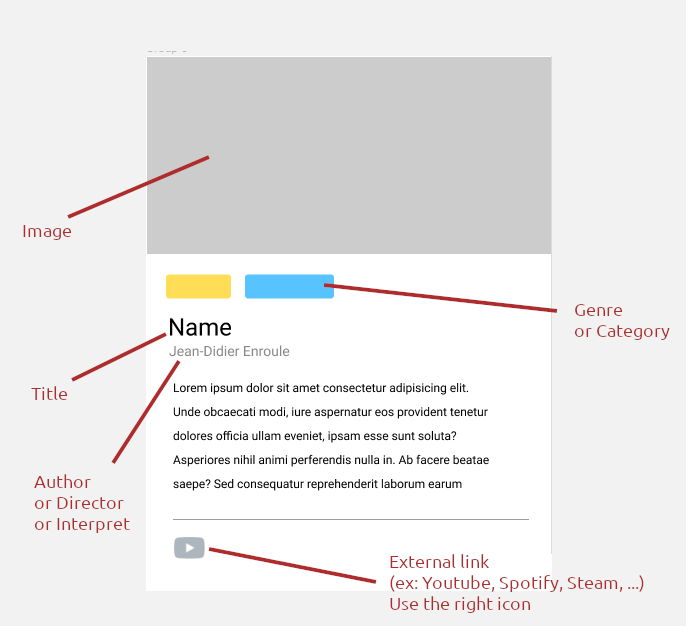

<h1> TheCollection </h1>

This project is about creating movie cards using js only, under no circumstances should you write to the index.html file, the html must be written entirely in js

<h3 style="text-align: left;">Added functionality :</h3>

I added the possibility of deleting the cards

<h3 style="text-align: left;">Example :</h3>

<h4 style="text-align: left;">Desktop version :</h4>

<h4 style="text-align: left;">Mobile version :</h4>

<i style="text-align: left;"> Fait par un professionel ! Ne faites pas ça chez vous</i>

